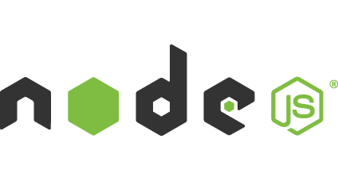

# Install Haxe and Node.js

Before you can use there are a couple of thing you need to do.

You need to install Haxe. There are a [couple of ways to do it](../haxe/installation.md), but in this document I will send you to the [official place](# haxe).

Don't want to kick in some open doors, but before you can use Node.js ... you need to [install](# node) that also.

And a [code editor](# ide) will be useful!

Last but not least, you need to install the [Haxe Externs](# externs). These are the "translators" from `untyped` node.js code to typed Haxe code. You need to install the Node.js externs but get other fun stuff as well. You will need them further on these documentation.

---

Current versions are:

- **Haxe** v3.2.1
- **Node.js** v0.12.7

But if the version numbers changed, it means I haven't updated this part of the document in some time :D

<a name="haxe"></a>

## Download Haxe


- Get your version here: [http://haxe.org/download/](http://haxe.org/download/)

<a name="node"></a>

## Download Node.js



- Get your version here: [https://nodejs.org/](https://nodejs.org/)

<a name="ide"></a>

## Code editor

If you work on Windows you should install [FlashDevelop](http://www.flashdevelop.org), on other platforms you should read this chapter: [Choosing a Code Editor](../haxe/choosing-a-code-editor.md)

<a name="externs"></a>

## Externs

Install the [official Haxe node.js externs](https://github.com/HaxeFoundation/hxnodejs) lib via [haxelib](http://lib.haxe.org/p/hxnodejs/).
Haxelib is automatically installed when installing Haxe and you can see it as a sort of NPM.

```bash
haxelib install hxnodejs
```

In this tutorial I use the js-kit externs, there are more ways to get externs but the js-kit has a lot so it's more a one stop shop thing!

```bash
haxelib git js-kit https://github.com/clemos/haxe-js-kit.git haxelib

```
